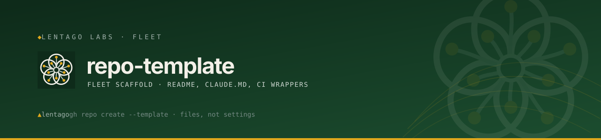

<!-- Lentago Labs brand header — generated by lentago/.github → brand/generate.py.
     Regenerate there; do not hand-edit the banner or badge URLs. -->

  

 

# [repo name]

[One-paragraph description of what this repo is and who it's for.]

**Authorship:** [Adjust to fit, but keep a co-authorship disclosure at the
top.] The [code / prompts / documentation] in this repo are co-written with
[Claude](https://claude.ai) (Anthropic). I direct the work and review the
output; Claude writes the [code / prose]. I'm an infrastructure operator, not a
software engineer — please don't read this repo as a portfolio of coding
ability.

## 📚 Ask this codebase (DeepWiki)

> [DeepWiki](https://deepwiki.com/lentago/repo-template) maintains an AI-generated wiki over this
> repository — architecture pages, diagrams, and a Q&A box grounded in the actual code. Every
> public Lentago Labs repo is indexed ([deepwiki.com/lentago](https://deepwiki.com/lentago));
> it is the fastest way to orient before reading source. It is AI-generated: trust it to orient
> you, verify against the code before you act on it.

**Good first questions:**

- What does creating a new repo from repo-template actually copy, and what do I still have to configure by hand afterward?
- Why is the docs-check workflow deliberately not path-filtered, and what would break if I added a paths filter to it?
- Why was the claude-code-review.yml automated PR review disabled, and how would I re-enable it?

## 🧭 What this repo demonstrates

The paved road: every Lentago Labs repo starts here and inherits these patterns on day one.

| Pattern | How it shows up here |
|---|---|
| Required status check via thin reusable-workflow wrapper | [`.github/workflows/docs-check.yml`](.github/workflows/docs-check.yml) delegates to `lentago/shared-workflows/docs-check.yml@main`; the branch ruleset requires the `docs-check / docs-check` context — change the logic once upstream and all repos inherit it |
| Deliberately non-path-filtered required check | `docs-check.yml` header comment explains: a path-filtered required check that never fires is held "Expected" forever, deadlocking every non-matching PR — the hard lesson from [lentago/.github#57](https://github.com/lentago/.github/issues/57) |
| Branch ruleset: squash-only, PR required, no force-push/deletion | Per-repo ruleset `lentago/repo-template` — textbook PR-gated change control where the merged PR is the change record; settings-as-code branch protection operators can point to as a live example |
| `@claude` interactive responder wired via reusable workflow | [`.github/workflows/claude.yml`](.github/workflows/claude.yml) wires an AI agent into the PR/issue lifecycle as a callable teammate, not a one-off script |
| Automated review deliberately disabled with an auditable off-switch | [`.github/workflows/claude-code-review.yml`](.github/workflows/claude-code-review.yml) switched to `workflow_dispatch` only on 2026-06-25 — toggling automation off is itself a reviewable, git-tracked decision ([PR #2](https://github.com/lentago/repo-template/pull/2)) |
| Settings-as-code is external to the template | [`SETUP.md`](SETUP.md) step 2: branch protection, merge-button, and topics are applied by `dotgithub/fleet-ops/fleet-apply.sh` after creation — a GitHub template copies files, not settings |
| Generated brand header with a do-not-hand-edit contract | The HTML comment above the banner: regenerate from `lentago/.github → brand/generate.py`, never hand-edit — single source of truth upstream, consumers regenerate rather than drift |
| Mandatory co-authorship disclosure baked into the template | The `**Authorship:**` block above ensures every derived repo opens with an AI co-authorship disclosure — structural governance, not an optional per-repo choice |

## 🛠️ Make a change yourself

This is a lab — the systems are real, the stakes are not. Pick a vector:

**Spin up a new repo compliant on day one (the paved road)**

Click "Use this template" on this repo to create a new lentago repo. The template copies `README.md`, `CLAUDE.md`, `SETUP.md`, the CI wrappers, `LICENSE`, and `assets/` verbatim — but not settings. Fill in the README/CLAUDE.md placeholders and replace the `review_prompt` placeholder in [`claude-code-review.yml`](.github/workflows/claude-code-review.yml) with a description of your repo's content. Then run `dotgithub/fleet-ops/fleet-apply.sh --apply --repo <new-repo-name>` to inherit squash-only merge, branch protection, and org topics. Replace `assets/banner.svg` via `lentago/.github`'s `brand/generate.py`, add the repo to `~/repos/CLAUDE.md`'s fleet inventory, delete `SETUP.md`, and open a PR with those changes. No apply-on-merge automation runs against the template itself — compliance is enforced by the `docs-check` required status check plus the org's fleet-baseline ruleset. Org membership is required to push branches; the fleet-apply script requires access to `dotgithub/fleet-ops/`.

**Proof this works:**
- [PR #9 — Adopt the shared docs-check workflow](https://github.com/lentago/repo-template/pull/9) — wires the template into the required docs-check check pattern every new repo inherits
- [PR #3 — Repoint reusable-workflow refs to the lentago org](https://github.com/lentago/repo-template/pull/3) — shows the template's CI wrappers being repointed after an org rename, evolving the shared base every new repo starts from
- [PR #1 — Update SETUP.md fleet-ops paths to dotgithub/fleet-ops/](https://github.com/lentago/repo-template/pull/1) — keeps the settings-application step accurate for every repo created from the template

## What's here

- [Key file / directory] — [purpose]
- [Key file / directory] — [purpose]

## [How it works / Usage]

[Fill in.]

---

> 🌱 **Lentago Labs** is a team learning lab — real systems, non-critical stakes, modern
> operations patterns demonstrated in the open. Start at the
> [org profile](https://github.com/lentago), and read this repo on
> [DeepWiki](https://deepwiki.com/lentago/repo-template).

<!--
  Created from lentago/repo-template. Templates copy FILES, not SETTINGS —
  after creating this repo, apply fleet settings (merge-button, topics, branch
  ruleset). See SETUP.md, then delete it.
-->
